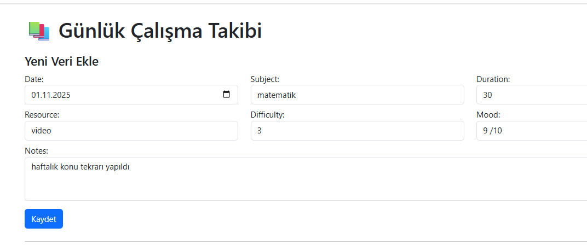
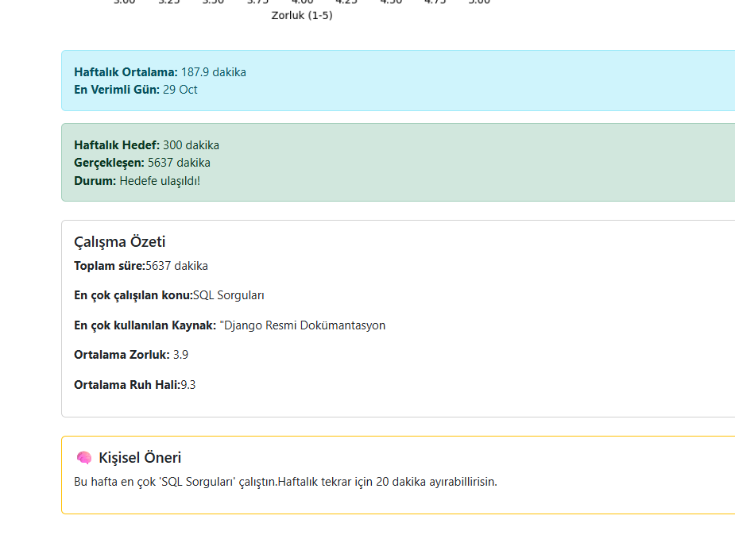
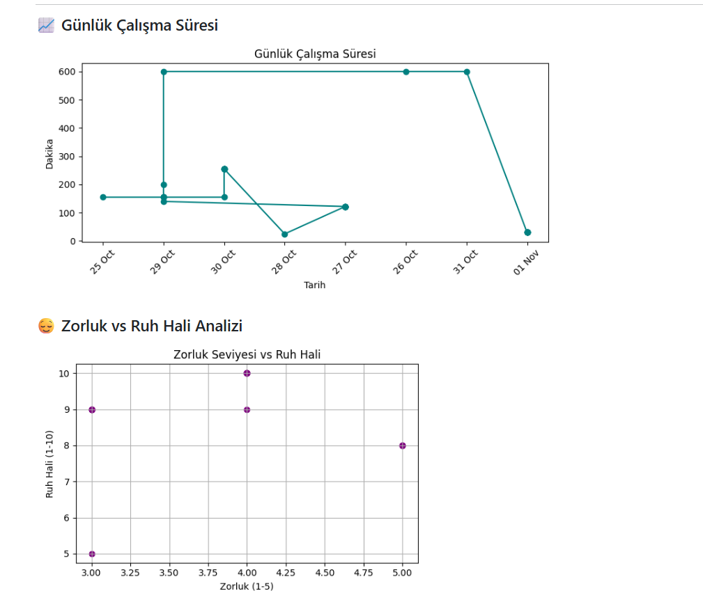

# 📚 StudySync – Kişisel Çalışma Takip Sistemi

StudySync, öğrencilerin günlük çalışma verilerini kaydedip analiz edebileceği, grafiklerle görselleştirebileceği ve kişisel öneriler alabileceği bir Django tabanlı web uygulamasıdır.

## 🚀 Özellikler
- 📋 Günlük veri girişi formu (konu, süre, kaynak, zorluk, ruh hali, notlar)
- 📈 Günlük çalışma süresi grafiği
- 🧠 Zorluk vs Ruh Hali analizi
- 🧾 Haftalık özet: ortalama süre, en verimli gün, en sık çalışılan konu
- 💡 Kişisel öneri sistemi
- 🔐 Kullanıcıya özel oturumlar (login sistemi)

## 📸 Ekran Görüntüleri
> Görselleri `screenshots/` klasörüne ekleyip aşağıdaki gibi çağırabilirsin:





## 🛠️ Kullanılan Teknolojiler
- Python & Django
- Matplotlib (grafik çizimi)
- HTML / CSS / Bootstrap
- SQLite (veritabanı)

## ⚙️ Kurulum
```bash
git clone https://github.com/Mylittlemary/studysync.git
cd studysync
pip install -r requirements.txt
python manage.py migrate
python manage.py runserver